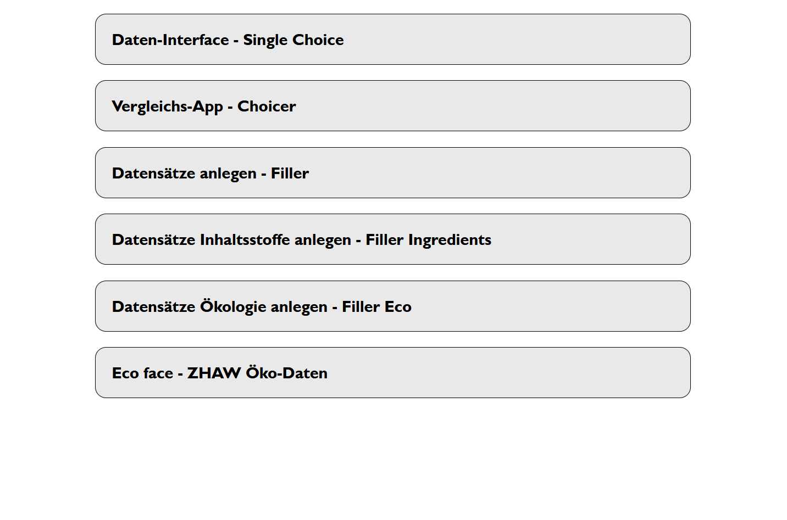

# DaPro - Datenbank Proteinreiche Lebensmittel im Unterricht - Anleitung und Übersicht

## Zugriff
Der Zugriff auf die Datenbank ist aus lizenzrechtlichen Gründen und wegen dem rechenschwachen Server-Prototypen nur von intern der ZHAW möglich (vor Ort oder per VPN).

---

## Schnittstellen

### Interfaces Überblick

Die [Interfaces im Überblick](http://microserver.zhaw.ch:3030/interface/index.htm). Sie sind alle pur in HTML/JS programmiert und greifen auf den zentralen [Datenbank-Server](http://microserver.zhaw.ch:3030) zu. Auf diesem läuft eine Instanz eines [Jena-Fuseki-Servers](https://jena.apache.org/documentation/fuseki2/).

---

### DaPro Single Choice

[Single choice](http://microserver.zhaw.ch:3030/interface/interface.htm) bietet ein Dropdown mit allen vorhandenen Lebensmitteln an. Zusammengesetzte Lebensmittel werden prozentual aufgeschlüsselt und alle Inhaltsstoffe werden dargestellt. Zudem werden die Aminosäurenprofile berechnet.

---

### DaPro Ecoface

[Das Interface für Ökodaten](http://microserver.zhaw.ch:3030/interface/ecoface.htm) liest die vorhandenen Daten aus der Datenbank aus.

---

### DaPro Choicer

[Der Choicer](http://microserver.zhaw.ch:3030/interface/choicer.htm) vergleicht zwei oder mehr Lebensmittel miteinander. Der Fokus liegt auf den grundsätzlichen Kenndaten, der Umweltbelastung und den Aminosäuremustern.

---

### Filler Rezept

[Der Rezept-Filler](http://microserver.zhaw.ch:3030/interface/filler.htm) bietet die Möglichkeit, ein eigenes Rezept (z.B. Tofu-Ceviche) aus den vorhandenen Zutaten anzulegen. Das abgespeichert Rezept im .owl-Format kann zur Wiederverwendung oder auch zum Sharen heruntergeladen werden.

---

### Filler Ingredients

[Der Zutaten-Füller](http://microserver.zhaw.ch:3030/interface/filler_ingredients.htm) erlaubt es, ein neues Lebensmittel mit seiner Zusammensetzung anzulegen (z.B. einen Mehlwurm).

---

### Filler Eco

[Der Ökologie-Filler](http://microserver.zhaw.ch:3030/interface/filler_eco.htm) erfasst Lebensmittel und ihre ökologischen Auswirkungen (z.B. CO2eq von Heuschreckenspeck).

---

## Protégé

Mit [protégé](https://protege.stanford.edu/) lassen sich .owl-Dateien öffnen, manipulieren, kombinieren und auch wieder abspeichern. Während sich Tabellen-Daten gut mit Excel bearbeiten lassen, empfiehlt sich für Graph-Daten protégé.

---

## Python

Die Schnittstelle auf dem Server lässt sich auch mit Python ansprechen. Ein [Beispiel-Script](./demo_inhaltstoffe.py) zeigt, wie es geht.